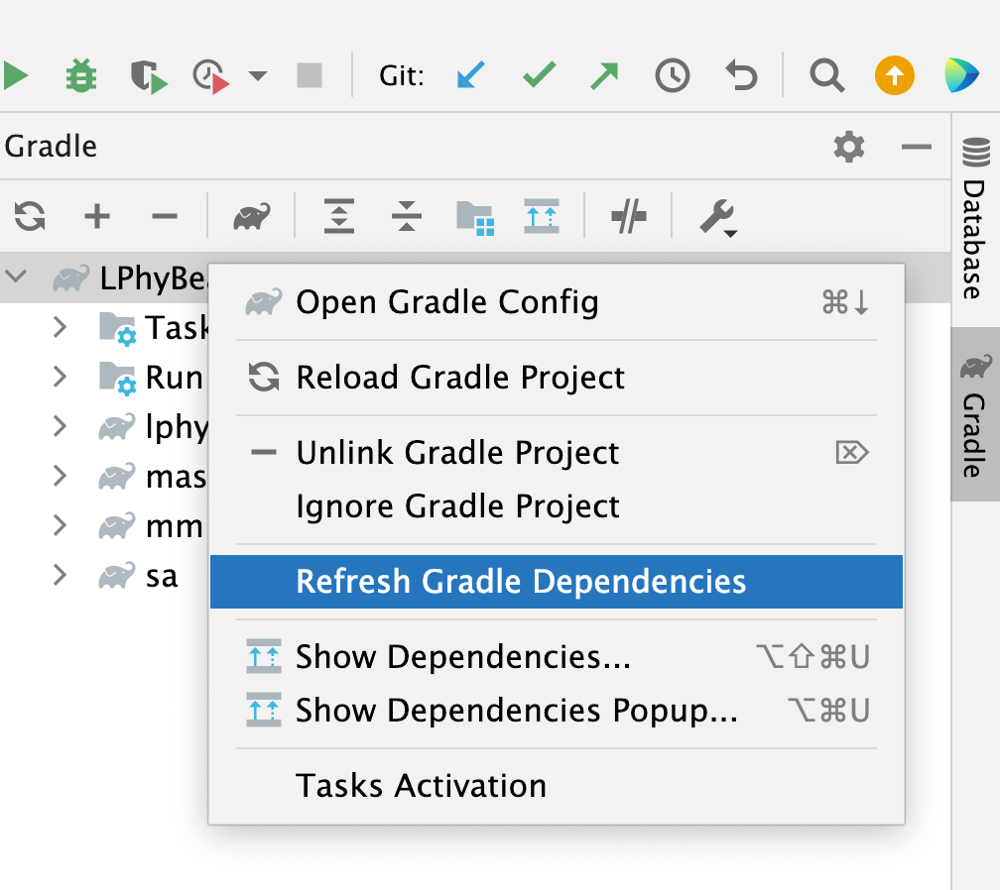
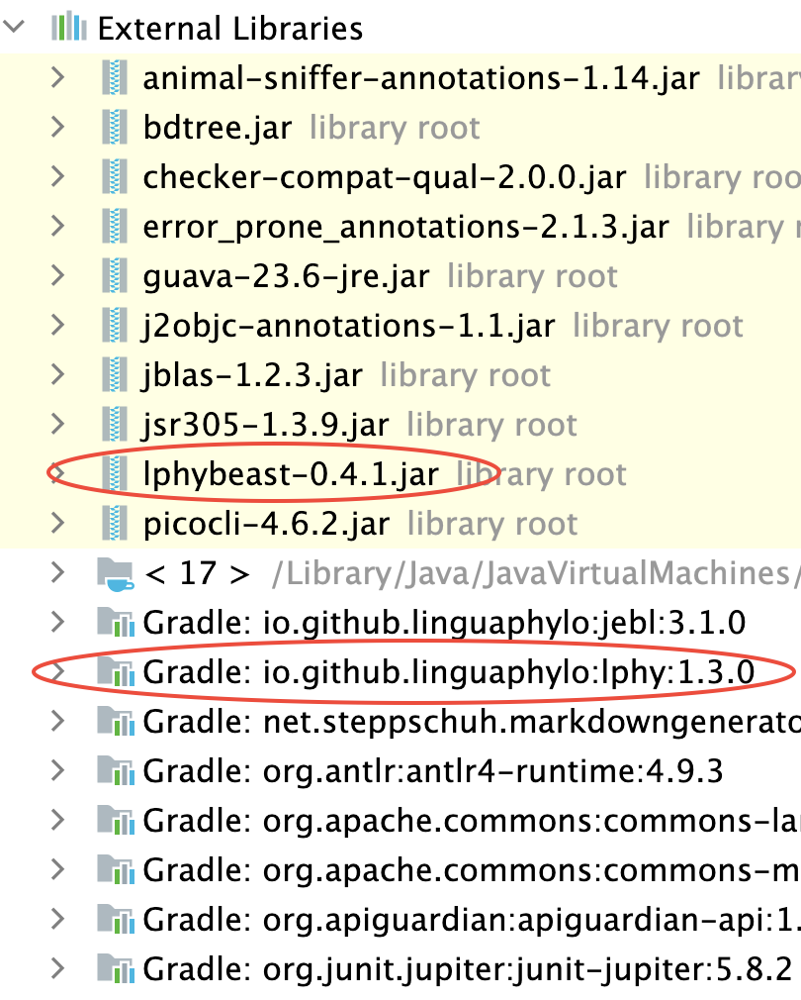

# LPhyBeast and its extensions 

LPhyBeast and its extensions are developed as [BEAST2 packages](https://www.beast2.org/managing-packages/).
More details are available for developers at https://linguaphylo.github.io/developer/.

## Gradle & development environment

Install [OpenJDK 17](https://jdk.java.net/17/) and [Gradle 7.x](https://gradle.org/install/). 

You can look at [Setup development environment](https://linguaphylo.github.io/developer/setup-dev-env/)
and [LPhy developer note](https://github.com/LinguaPhylo/linguaPhylo/blob/master/DEV_NOTE.md) for more details.

## Dependencies 

LPhyBeast depends on LPhy and [few BEAST 2 packages](version.xml). 
Its extensions depend on LPhyBeast, corresponding LPhy extensions and corresponding BEAST 2 packages.
A case study is available at https://linguaphylo.github.io/developer/dependencies/.

The Gradle project is using more restricted configuration between different projects,
which requires to read the source code from the released jars.
Please read [the difference between libraries and applications](https://docs.gradle.org/current/userguide/library_vs_application.html).

We use the default model ["require"](https://docs.gradle.org/current/userguide/rich_versions.html#sec:strict-version)
declaring versions, such as `io.github.linguaphylo:lphy:1.3.1`.
This implies that the selected version of lphy cannot be lower than 1.3.1
but could be higher through conflict resolution, when there are multiple versions in the local dependency repository.
When the exact version is required, the ["strictly"](https://docs.gradle.org/current/userguide/single_versions.html#simple_version_declaration_semantics)
declaring versions can be used.
For example, if only lphy 1.2.0 is required, you can use `io.github.linguaphylo:lphy:1.2.0!!`.

### Dependencies to zip files

BEAST 2 packages are released as zip files. LPhyBeast and [LPhyBeastExt](https://github.com/LinguaPhylo/LPhyBeastExt)
are published to [Maven linguaphylo group](https://search.maven.org/search?q=io.github.linguaphylo).
Using the predefined [Gradle function](https://github.com/LinguaPhylo/LPhyBeastExt/blob/a31263ef418c63596515eb2ee1b308046423184e/lphybeast-ext/build.gradle.kts#L21-L56), 
the zip file can be downloaded and unzipped automatically, and then jars will be loaded into the library. 

### Update dependencies in Intellij

[//]: # (<a href="./GradleJVM.png"></a>)
<a href="./GradleJVM.png"></a>

<a href="./GradleJVM.png"></a>

For the standard dependency configurations, it is simple as that, 
you just change the version in the build file and click the "refresh" icon in the top right corner.
IntelliJ will complete updates by itself. 

But if the dependency is a zip file (a BEAST2 package), you have to use the manual process below:

1. Click "Refresh Gradle Dependencies" to download the latest version (e.g. lphybeast-?-?-?.zip) from Maven repo.
   This can also [force updating all the snapshot Gradle dependencies in intelliJ](https://stackoverflow.com/questions/32652738/how-can-i-force-update-all-the-snapshot-gradle-dependencies-in-intellij).

2. Click the task `clean` and then `build` to rebuild the project from [Gradle tool window](https://www.jetbrains.com/help/idea/jetgradle-tool-window.html),
   which unzips the zip file and loads all libraries.
   Alternatively, run `./gradlew clean build` in the terminal.

3. Click "Reload All Gradle Projects" to loads all libraries into IntelliJ. 
   Check the "External Libraries" to see if the updated version is successfully loaded.
   If the new version of lphybeast still does not exist, try to rebuild the project and "Reload ..." again.

See also, [encourage IntelliJ to reload any changes](https://www.jetbrains.com/idea/guide/tutorials/working-with-gradle/syncing-and-reloading/). 

## Release procedure

1. Check all versions, for snapshot, make sure they contain the postfix "SNAPSHOT".
   Otherwise, for final release, make sure every postfix "SNAPSHOT" is removed.
   Run the command below in the terminal, which includes all unit tests.

```bash
./gradlew clean build --no-build-cache
```

Please note if the zip file includes multiple jars from different subprojects (e.g. LPhyBeastExt), 
then you need to run the step 2. Check the message to see if the jars were included. 

2. Run the command below, only when the zip file includes multiple jars.
   The zip file looking like `lphybeast-x.x.x.zip` will be available at
   `$PROJECT_DIR/lphybeast/distributions`.

```bash
./gradlew build -x test
```

Tips: for extensions, you can create an empty subproject to handle the lphybeast core,
to reduce the complexity of dependencies in other subproject(s).
For example https://github.com/LinguaPhylo/LPhyBeastExt/tree/master/lphybeast-ext.

3. Run the (1 line) command below to publish to the Maven central repository. 

```bash
./gradlew publish --info 
    -Psigning.secretKeyRingFile=/path/to/.gnupg/mysecret.gpg 
    -Psigning.password=mypswd -Psigning.keyId=last8symbols 
    -Possrh.user=myuser -Possrh.pswd=mypswd
```

Please note: if not snapshot, once it is published, you will not be able to remove/update/modify the release.

4. For final release, follow the [instruction](https://central.sonatype.org/publish/release/) to manually
   complete the releasing deployment, otherwise skip this and move to the next step. 
   In addition, the __CBAN__ needs to be updated so that it can appear in Package Manager.

For snapshots, check files in https://s01.oss.sonatype.org/content/repositories/snapshots/io/github/linguaphylo/.
For releases, check files in https://s01.oss.sonatype.org/content/repositories/releases/io/github/linguaphylo/.

We recommend to use the URL available in Maven search engine, which looks like
`https://repo.maven.apache.org/maven2/io/github/linguaphylo/...`.
However, it will take about 1 day to synchronise from the releases repo to the search engine.
If you want the release available immediately, the URL in the releases repo above can be used in CBAN for a temporary solution.
Then, please remember to change the URL next day. 

5. Run the [testing pipeline for tutorials](https://github.com/LinguaPhylo/LPhyBeastTest) using SNAPSHOT versions first (set `env.PRERELEASE=true`).
   After all tests are passed, remove "-SNAPSHOT" from LPhyBeast version, and repeat these steps from 1 to make the final release.
   Then run the testing pipeline again after setting `env.PRERELEASE=true` 

## Test

We recommend you copy
- [these unit tests](https://github.com/LinguaPhylo/LPhyBeast/tree/master/lphybeast/src/test/java/lphybeast)
to check the XMLs.
- [these integration tests for tutorials](https://github.com/LinguaPhylo/LPhyBeastTest) 
to check the BEAST2 runs and the logs.

Two-stage tests are also recommended, the first stage tests the pre-released version (e.g. snapshot),
in order to find any bugs before the final release.
This can be done programmatically by setting the customised BEAST2 package directory `-Dbeast.user.package.dir=...`.
The second stage repeats the same process but tests the final release.

## Useful Links

- [LPhy developer note](https://github.com/LinguaPhylo/linguaPhylo/blob/master/DEV_NOTE.md)

- [Maven linguaphylo group](https://search.maven.org/search?q=io.github.linguaphylo)

- [LPhyBeastExt](https://github.com/LinguaPhylo/LPhyBeastExt)

- [Testing pipeline for tutorials](https://github.com/LinguaPhylo/LPhyBeastTest)

- [beast-phylonco](https://github.com/bioDS/beast-phylonco)

