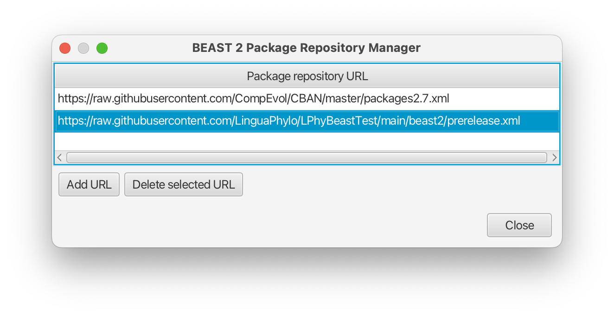
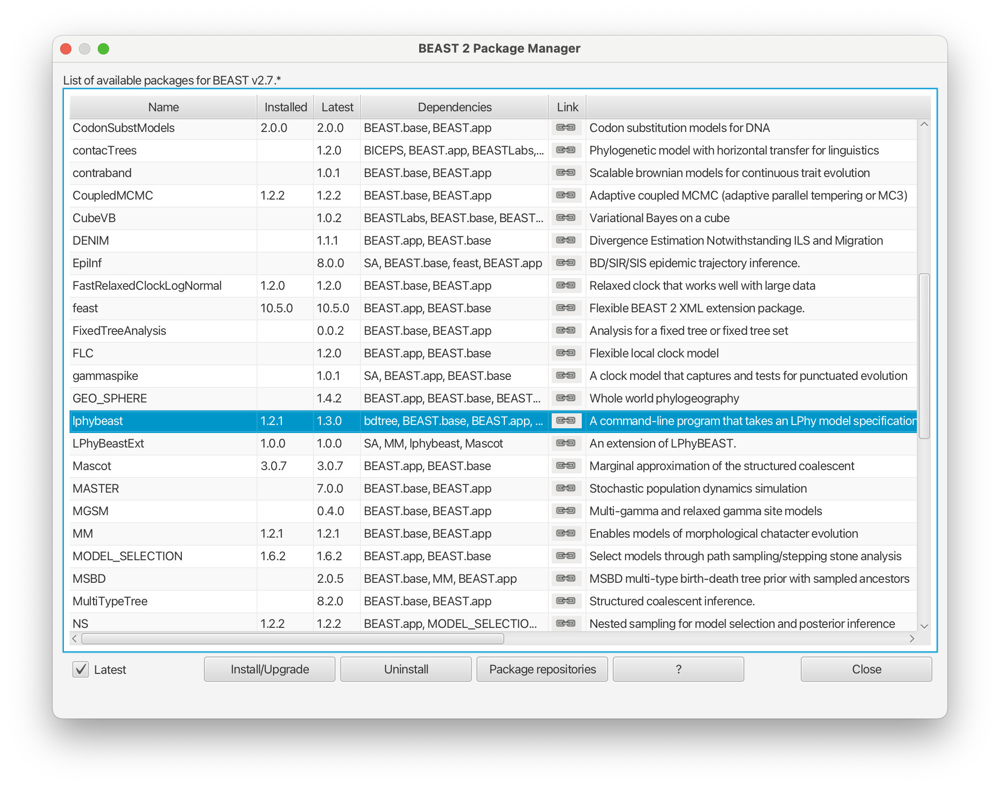

# Developer Guide - Test Instruction for LPhyBEAST

LPhyBEAST requires Java 17.

To test pre-released LPhyBEAST, ensure that all required LPhy and BEAST 2 packages are installed beforehand.
If you are using pre-release versions, follow the separate instructions for installing them.
After installation, print out the package versions to verify that you are testing against the correct ones.


## LPhy and the script to launch LPhyBEAST

Follow the user manual below to install the pre-release version of LPhy using the same process, 
and then set up the `lphybeast` script

https://linguaphylo.github.io/setup/


## Install pre-released LPhyBEAST from Package Manager

1. Open "Package Manager" using BEAUti, click the button "Package Repository", 
and then click the button "Add URL" to add the following URL :

https://raw.githubusercontent.com/LinguaPhylo/LPhyBeastTest/main/beast2/prerelease.xml

It should look like the screenshot below:

<a href="./LPhyBeastTestRepo.png"></a>

2. Install pre-released LPhyBEAST 

After "Close" the window, you will see the version of LPhyBEAST refreshed. 
For example, we are testing 1.3.0 and the latest release is 1.2.1.

<a href="./PackageManager.png"></a>

Click the button "Install/Upgrade" to install the pre-release.

**Note:** if you have a problem to install it using GUI, 
you can use the following commands in your terminal instead.

Check the current versions:

```bash
$BEAST2_PATH$/bin/packagemanager -list
```

Remove `lphybeast`. If you installed its extensions, you need to remove those extensions first.

```bash
$BEAST2_PATH$/bin/packagemanager -del lphybeast
```

Install `lphybeast`.

```bash
$BEAST2_PATH$/bin/packagemanager -add lphybeast
```

Then, check the versions again.

3. Run the `lphybeast` script to verify that `LPHY_LIB` points to the correct directory.

```bash
$YOUR_PATH$/bin/lphybeast -V
```

For example, a successful output to use LPhy 1.7.0 looks like this: 

```
openjdk version "17.0.5" 2022-10-18 LTS
...
LPHY_LIB = /Applications/lphystudio-1.7.0/lib
```
**Note:** if it does not, remove any other LPhy versions that could be interfering with the path.

## After tests are done

Once all tests are finished and the official version is released,
remember to update your setup to use the latest release instead of the testing version.
